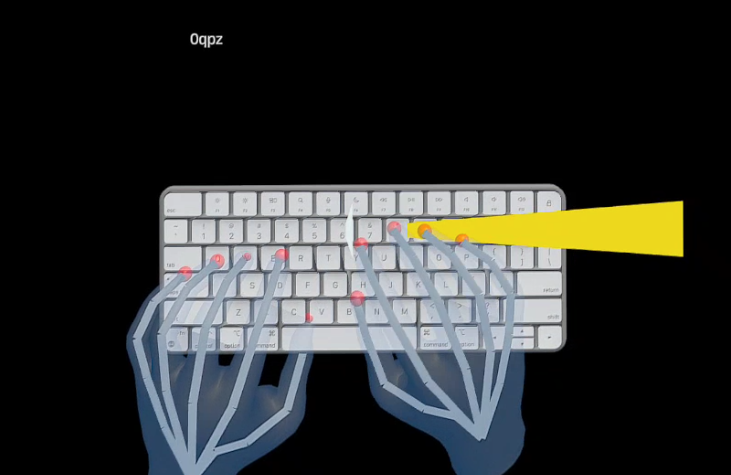
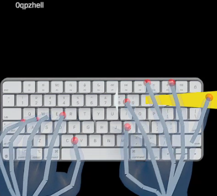

# 🧭 Quest Pro Typing Capture with Eyegaze and Hand Tracking

This Unity project enables VR typing tracking using a **real physical keyboard** and the **Meta Quest Pro**'s hand tracking and eye gaze capabilities. It is designed for **data collection**, prototyping, and natural typing experiments in mixed reality.

---

## 🧠 Overview

### What this project does

- Uses **hand tracking** and **eyegaze** from Meta Quest Pro
- Displays characters typed on a **real Apple Magic Keyboard**
- Aligns the virtual keyboard using a **manual calibration gesture**
- Renders text live in 3D VR space as you type

---

## ⌨️ How the Keyboard Input Works

- The **Apple Magic Keyboard** is connected to a PC
- A **Python script** reads keypresses (using `pynput`) and sends characters via **UDP**
- Unity receives these characters and displays them using TextMeshPro

### Usage:

- 🧪 **In Editor (same PC):** use `127.0.0.1` (localhost)
- 🚀 **On Quest Pro (deployed APK):**
  - Ensure both PC and Quest are on the **same WiFi**
  - Set the Python script’s target IP to the **Quest’s IP**
  - You can find it with:
    ```bash
    adb shell ip addr show wlan0
    ```

---

## 📡 Python UDP Sender

> 🧩 **Python requirements:** install `pynput` via pip

```bash
pip install pynput
```

Then run this:

```python
from pynput import keyboard
import socket

UDP_IP = "127.0.0.1"  # Change to Quest's IP when deployed
UDP_PORT = 5005
sock = socket.socket(socket.AF_INET, socket.SOCK_DGRAM)

def on_press(key):
    try:
        sock.sendto(key.char.encode('utf-8'), (UDP_IP, UDP_PORT))
    except:
        pass

with keyboard.Listener(on_press=on_press) as listener:
    listener.join()
```

---

## 🎯 Calibration Process

Before using the system, the user must perform a **manual calibration** to align the virtual keyboard with the physical one.

### ✅ Orientation Step (Before Calibration)

> Before registering the keyboard, the user must **align themselves properly**:
> - Look toward the **virtual keyboard model**
> - Rest hands on the **real keyboard** in a natural typing pose
> - Ensure the **index fingertip is flat on the key surface**
> - The accuracy of calibration depends on **realistic hand placement**

### 🧩 Calibration Steps

1. Using your **left index finger**, press the following physical keys:
   - `Q`
   - `P`
   - `Z`
2. The system:
   - Records the **fingertip world-space positions**
   - Matches them to the virtual keyboard model
   - Applies a **pure translation** (no rotation or scaling)

> You can repeat this process as needed. If you press the same points again with the same hand posture, the virtual keyboard should **not move again** (delta ≈ 0).

---

## 📐 Hierarchy & Object Layout

- The `pivot` object is the parent of:
  - `keyboard`
  - `hands`
  - `TextMeshPro` text display
  - `TextEntryVR.cs` (UDP receiver)
  - `Calibration.cs`
- The `pivot` updates its position every frame by **copying the position and rotation of the Quest Pro's `CenterEyeAnchor`**, effectively tracking the user's head.

- The calibration and text input systems operate **relative to the pivot**, ensuring the entire setup moves naturally with the user.

> ⚠️ Object transforms may differ between **Editor view** and **Quest standalone build** — fine tuning may be required after deployment.

---

## ⚠️ Notes on Precision

- **Oculus Quest Pro** hand and eye tracking are not perfectly accurate
- Expect small deviations in position and gaze due to:
  - Sensor noise
  - Pose ambiguity
  - Finger occlusion
- Recalibration may be needed periodically during testing

---

## 📂 Project Files

| File/Script              | Purpose                                                |
|--------------------------|--------------------------------------------------------|
| `EyeHands4TrackingWKeyboard` | Main Unity scene                                     |
| `TextEntryVR.cs`         | Handles incoming characters over UDP                   |
| `Calibration.cs`         | Captures calibration touches and applies alignment     |
| `EyetrackingGaze.cs`     | Reads and logs eyegaze input                           |
| Red fingertip spheres    | Used instead of full hand meshes for visual debugging  |

---

## 🖼️ Example Screenshots

<!-- Replace these with your own screenshots -->
### ✅ Calibrated Keyboard Alignment


### 👁️ Live Typing with Eye Gaze


---

## 🧪 Testing Notes

- ✅ Tested with **Unity 2022.3.5f1**
- 🛰 UDP server listens on **port 5005**
- 🔁 You can recalibrate at any time (use Q, P, Z again)
- 🧩 The calibration points (`Qcalibration`, etc.) should **not move** with the keyboard — place them outside its hierarchy if needed

---

## 📝 TODO

- [ ] Add logging of:
  - [ ] Keypresses with timestamps
  - [ ] Hand fingertip positions
  - [ ] Eye gaze raycast hit positions
  - [ ] Keyboard model transform (position)
- [ ] Add instrution panel
- [ ] Connect to the new panel (from the previous experiment)
- [ ] Connect the logic of the previous experiment (63 sentences)

---

## 💡 Tips

- Don’t attach calibration transforms (`Qcalibration`, etc.) as children of the keyboard model
- For best results, **disable full hand rendering** and use **red fingertip spheres** for visual calibration accuracy
- `EyetrackingGaze.cs` can be expanded for experimental gaze tracking or visual analytics

---

## 📎 License


---

## 🙋‍♂️ Contact

For questions or extensions, contact:

- Daniele Giunchi — d.giunchi@bham.ac.com
- Maisy Rapata — m.rapata@bham.ac.uk

📍 VRLab — University of Birmingham, 2025
